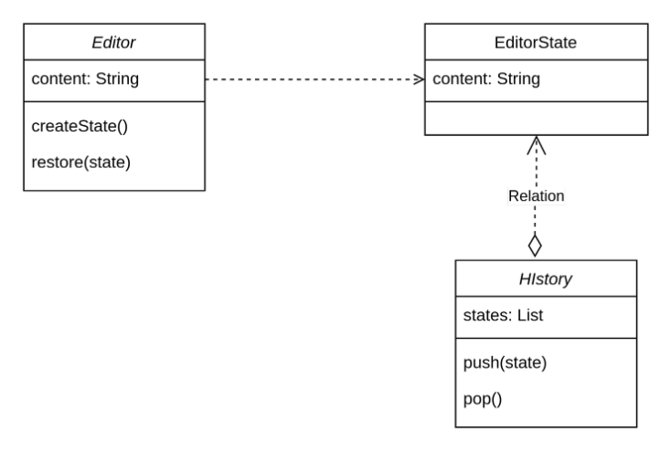

# Description

## Usage of memento design pattern

For implementation of undo mechanism, a way to store previous state
of an Object.

## Memento
The basic object that is stored in different states.

In the example Editor State is Memento.

## Originator
Sets and Gets values from the currently targeted Memento.
Creates new Mementos and assigns current values to them.

In the example Editor is the Originator.

## Caretaker
Holds an ArrayList that contains all previous versions of the Memento.
It can store and retrieve stored Mementos.

In the example History is Caretaker. 

