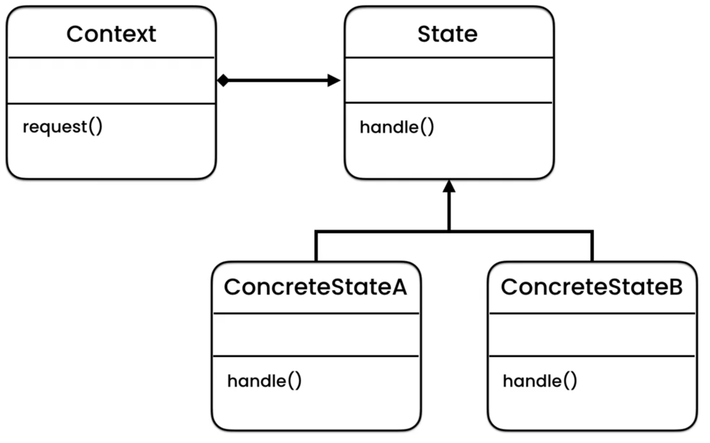
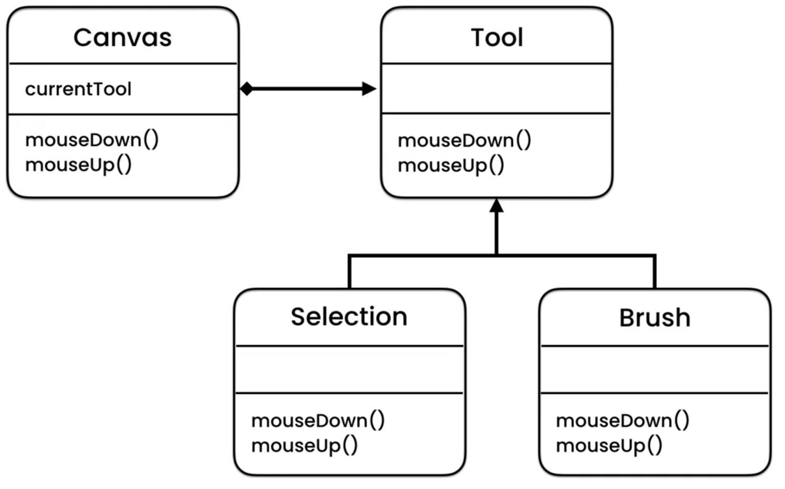

# Description
## Usage
It states that an object behaves differently at the current state
i.e. if state changes the object behaves differently.

The pattern suggests that you extract all state-specific code into a set of distinct classes. As a result, you can add new states or change existing ones independently of each other, reducing the maintenance cost.

Use the pattern when you have a class polluted with massive conditionals that alter how the class behaves according to the current values of the class’s fields.

The State pattern lets you compose hierarchies of state classes and reduce duplication by extracting common code into abstract base classes.

This pattern shows the **_polymorphism_** in action.

# OOP principle
This pattern shows us the very important principle in OOP.
**Open Closed Principle**: This means that the classes should be open for 
extension but closed for modification.
So we are not allowed to change the code in classes, we can only extend it.

So with this principle we can add new functionality without changing the code.
We can support functions by adding new classes.

This principle makes our application extensible and robust.

# Diagram
The following pseudocode is based on GOF.

The example pseudocode.

